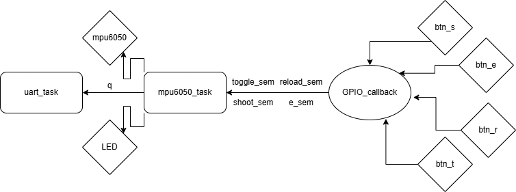

- Jogo: Shell Shockers (https://www.crazygames.com/game/shellshockersio)

- Ideia do controle: Simular as funções de um controle para jogo de tiro

- Input e Outputs:
    Botão Preto para Atirar,
    Botão Azul para Recarregar,
    Botão Verde para Trocar de Arma,
    Botão Amarelo para Ligar e Desligar,
    LED verde que indica o estado do controle (on/off)

- Protocolos utilizados: GPIO, I2C, IRQ

-Diagrama: 

-Vídeo das funcionalidades da arma: https://youtu.be/70cM7c7KZPk